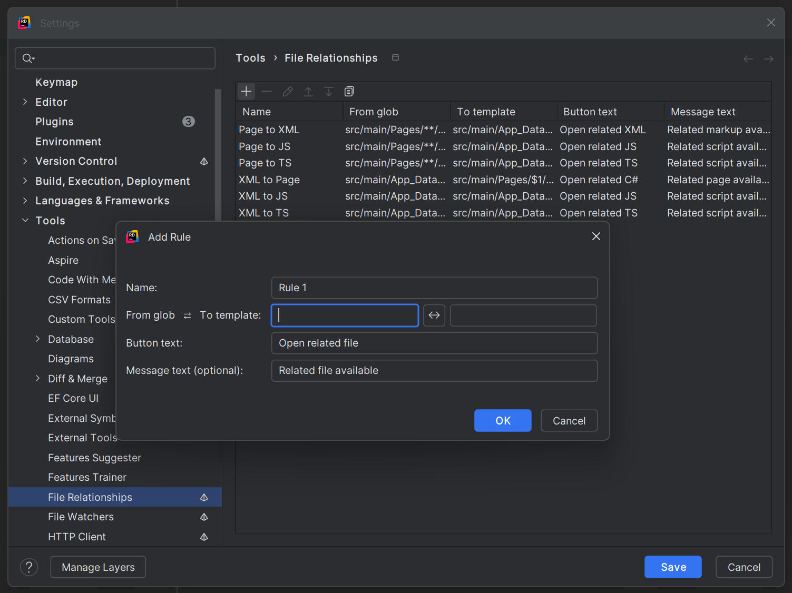
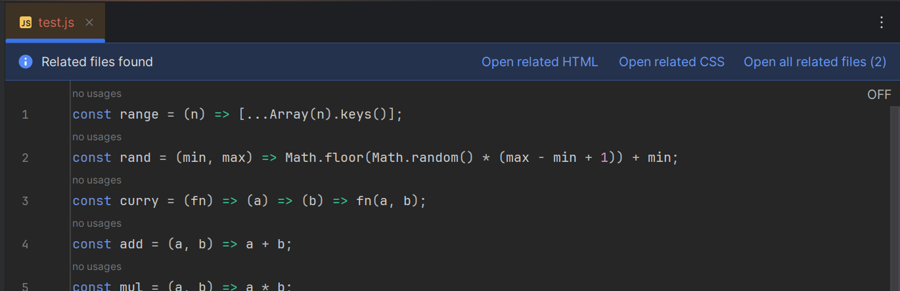

# File Relationships — Rider plugin

A Rider plugin that lets you define relationships between files based on folder/path patterns and open the related file in one click.

## How it works
- The plugin computes the file path relative to the project root and tries your rules in order. All matching rules are considered to show related targets.
- If a rule maps the current file to a related path and that target file exists on disk, the plugin shows:
  - an editor notification banner with a button, and
  - an editor context menu action (right‑click in the editor).
- Clicking either opens the related file.

## Configure via Settings UI
You can configure rules in Rider Settings.

- Open: File > Settings > Tools > File Relationships (or on macOS: Rider > Settings > Tools > File Relationships).
- Use the table to add, remove, edit, duplicate, or reorder rules. Each row contains:
  - Name
  - From glob
  - To template
  - Button text
  - Message text (optional banner text)
- Add opens a small dialog to enter or flip From/To more comfortably; you can also edit inline in the table.
- Validation requires From glob and To template to be non‑empty.
- Click Apply or OK to save. Changes are stored per project and take effect immediately.

Settings UI:


## Rule model (per project)
Rules are stored in your project under .idea/fileRelationships.xml. Each rule has:

- id — internal unique identifier (auto-generated; not shown in the Settings UI)
- name — friendly name
- fromGlob — source file pattern (relative to project root)
- toTemplate — target path template (relative to project root)
- buttonText — label shown in the UI (defaults to "Open related file" if blank)
- messageText — optional banner message shown in the editor (defaults to "Related file available" if blank)

## Pattern syntax
Use forward slashes '/' in patterns. The plugin normalizes paths on all OSes.

- fromGlob wildcards:
  - `*` matches a single path segment (no '/')
  - `**` matches across multiple segments (can include '/')
- Captures: referenced in toTemplate as `$1`, `$2`, ...
- Rule order matters for display: when multiple rules match, their buttons appear in rule order.

## Example
Generic mapping from source code to related markup:

```
fromGlob:   src/pages/**/*.cs
toTemplate: resources/xml/pages/$1/$2.xml
buttonText: Open related XML
```

This maps, for example:

```
src/pages/Area/Sub/Page.cs
→ resources/xml/pages/Area/Sub/Page.xml
```

## UI surfaces
- Editor banner: shown only when at least one related file exists for the opened file. For multiple matches, the banner shows one button per match (using each rule’s `buttonText`) and an extra “Open all related files (N)” action.
- Editor context menu: a dynamic action appears; it shows the matched rule’s label for a single match, or “Open related files (N)” for multiple.

Editor banner:



## Advanced: edit the XML directly
You can also edit the rules file directly if you prefer:

```
.idea/fileRelationships.xml
```

Notes:
- Use forward slashes '/' in patterns; paths are normalized internally on all OSes.
- All matching rules are considered for display; rule order controls the order of buttons and actions.

## Run locally (develop/test)
Prerequisites:

- JDK 17 (e.g., JetBrains Runtime 17 or Microsoft OpenJDK 17)

Launch a Rider sandbox with the plugin:

Using Rider's Run/Debug configurations:
- In Rider, open the Run/Debug configurations dropdown.
- You will find two pre-configured entries:
  - "Gradle build" (runs the build task)
  - "Gradle runIde" (launches a Rider sandbox with this plugin)
- These are stored under the .run directory in the repository and should appear automatically. If they don't, ensure the .run folder is included in your project and VCS checkout.

```powershell
# From repo root
.\gradlew.bat build    # optional sanity build
.\gradlew.bat runIde   # launches a sandbox Rider with the plugin
```

Open a solution and try a file that matches a rule. If the related file exists, you will see the banner/action.

Sandbox logs: `build\rider-sandbox\system\log\idea.log`

Install into your Rider:

```powershell
.\gradlew.bat buildPlugin
```
Then in Rider: File > Settings > Plugins > gear icon > Install Plugin from Disk... and choose the ZIP from `build\distributions`. Restart Rider.

## Known IDE log warnings (not from this plugin)
These messages may appear in idea.log when running in a sandbox. They are emitted by bundled plugins or the IDE platform and are not caused by this plugin:

- ComponentManagerImpl: `preload=TRUE`/`preload=NOT_HEADLESS` must be used only for core services — emitted by bundled plugins (e.g., Razor, CWM, SQLProj, Full Line Completion). Safe to ignore in sandbox.
- RunManager: `Must be not called before project components initialized` — transient during startup while the IDE initializes components.
- Rider Unity ImageIconConverter warnings — come from the Rider Unity plugin loading SVGs. Harmless.
- Windows shell integration COM error (WinShellIntegration/WinDockDelegate) — related to Windows jump list updates; not related to this plugin. You can disable Windows Jump Lists in Settings > Appearance & Behavior if it’s noisy.
- Slow contributor warnings (ClassSearchEverywhereContributor) — search subsystem reporting slow contributors; not related to this plugin.
- SlowOperations on EDT stack traces whose frames point to IDE indexing/highlighting (WorkspaceFileIndexImpl, FrontendDaemonHost, etc.) — platform activity. This plugin avoids IO on EDT and performs action updates in BGT. If you ever see `com.jetbrains.rider.plugins.filerelationships` in such a stack trace, please open an issue with the log snippet.

To minimize our own footprint:
- The editor banner and action visibility use Virtual File System lookups only (no direct disk IO).
- We skip logic until the project is initialized and also skip during indexing (Dumb mode).

## Troubleshooting
- No banner/action? Ensure the target file exists and the opened file’s relative path matches `fromGlob`.
- Project base: paths are resolved relative to the project root; open the solution at the repository root (or adjust patterns).
- Windows paths: use '/' in patterns; the plugin converts internally.
- Logs: Help > Show Log in Explorer (installed Rider) or `build\rider-sandbox\system\log\idea.log` (sandbox).


## Publish to JetBrains Marketplace (Rider)
There is no separate "Rider" option when creating or uploading a plugin in JetBrains Marketplace. Rider is an IntelliJ-based IDE, and the Marketplace infers product compatibility from the plugin's dependencies. This plugin declares <depends>com.intellij.modules.rider</depends> in META-INF/plugin.xml, so Marketplace will recognize it as a Rider plugin automatically.

Two ways to publish:

1) Automated via Gradle (recommended)
- Create a Marketplace token: https://plugins.jetbrains.com/ > your avatar > My Tokens > Generate new token (grant "Upload new plugin version").
- In PowerShell (Windows), set environment variables:
  - $env:MARKETPLACE_TOKEN = "your-token-here"
  - Optional: $env:MARKETPLACE_CHANNEL = "default" (or "stable", "eap")
- Build and publish:
  - .\gradlew.bat buildPlugin publishPlugin
- The Gradle IntelliJ Platform plugin will upload the ZIP from build\distributions. Channels default to "default" if not set.

2) Manual upload via web UI
- Build the plugin ZIP: .\gradlew.bat buildPlugin
- Go to https://plugins.jetbrains.com/ > Upload plugin > IntelliJ-based IDEs and upload the ZIP from build\distributions.
- Marketplace will automatically mark the plugin as compatible with Rider (no separate Rider toggle is required). Verify that "Compatible Products" shows Rider before publishing.

Notes
- Version: update gradle.properties (pluginVersion=...) before publishing. The build patches plugin.xml automatically.
- Change notes: taken from CHANGELOG.md by the build (patchPluginXml). You can also edit change notes in the Marketplace UI during upload.
- Installing locally: you can always install the ZIP from build\distributions in Rider via Settings > Plugins > gear icon > Install Plugin from Disk.


## CI: GitHub Actions auto‑publish
A GitHub Actions workflow is included to automatically build and publish the plugin to JetBrains Marketplace.

- File: .github/workflows/publish.yml
- Triggers: pushing a tag matching v* (e.g., v1.2.3) or publishing a GitHub Release.
- Requirements: set repository secret MARKETPLACE_TOKEN with a token from https://plugins.jetbrains.com/ (My Tokens > Upload new plugin version). Optional: MARKETPLACE_CHANNEL to override the default channel.
- Channel selection: defaults to "default". If the GitHub Release is marked as pre‑release or the tag name contains -eap/-beta/-rc, the workflow uses the "eap" channel automatically.

Typical flow to keep the plugin updated automatically:
- Bump pluginVersion in gradle.properties.
- Commit and push.
- Create an annotated tag like v1.0.1 and push it, or draft a GitHub Release. The workflow will build and publish using the configured token.


## Marketplace screenshots slider (IDE built-in gallery)
The screenshots carousel you see at the top of many plugin pages (both on plugins.jetbrains.com and in the IDE’s Plugins UI) is controlled by the Marketplace listing’s Media/Screenshots — it does not come from plugin.xml or the README.

How to use it:
1. Open: https://plugins.jetbrains.com/ → Your plugin → Edit.
2. Go to the Media (or Images) section and add Screenshots.
3. Upload PNG/JPG images, drag to reorder, optionally add captions.
4. Save. The slider will appear above the Overview section for your plugin.

Notes and tips:
- Managed in Marketplace, not in code: The Gradle publishPlugin task updates binary, description, and change notes, but does not upload or modify screenshots. Your screenshots persist across versions until you change them in the listing.
- Use the assets in this repo: we keep screenshots under docs/images for convenience.
  - docs/images/editor-banner.png
  - docs/images/settings-ui.png
  - Raw URLs (useful for README/plugin.xml embeds):
    - https://raw.githubusercontent.com/sortbyfirstname/file-relationships-rider-plugin/main/docs/images/editor-banner.png
    - https://raw.githubusercontent.com/sortbyfirstname/file-relationships-rider-plugin/main/docs/images/settings-ui.png
- Sizing guidance: prefer widths in the 1200–2400 px range so text is readable; PNG is best for UI shots. Keep file sizes reasonable for fast loading.
- Automation: If you need to manage screenshots programmatically, use the JetBrains Marketplace HTTP API for media assets (requires a token). The Gradle IntelliJ Platform plugin does not handle screenshots.
- README/plugin.xml images: You can continue embedding images in the README and plugin.xml description (we do) for context in the Overview body, but these do not feed the top slider.
